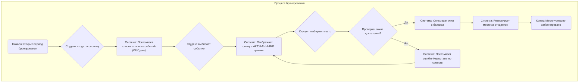
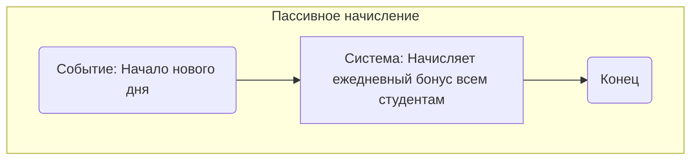
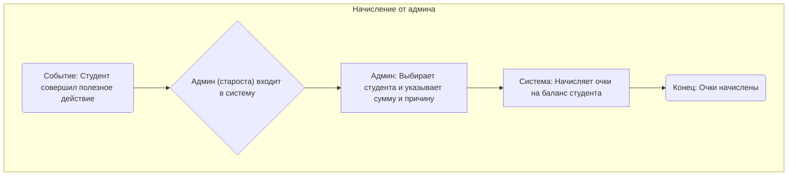
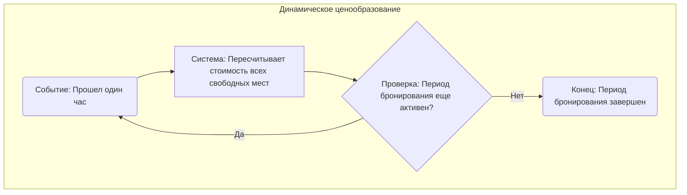

# BPMN-диаграммы: Процессы системы бронирования

В этом документе описаны основные бизнес-процессы системы "Scat Booking System".

---

## 1. Основной процесс: Бронирование места студентом

Этот процесс описывает основной сценарий взаимодействия пользователя с системой: от выбора события до успешного бронирования места.

---

## 2. Вспомогательный процесс: Начисление очков

Этот раздел описывает два способа, которыми студенты могут получать очки.

### 2.1. Пассивное начисление

Система автоматически начисляет небольшое количество очков всем студентам ежедневно.

### 2.2. Начисление администратором (старостой)

Администратор может вручную начислять очки за особые заслуги.

---

## 3. Вспомогательный процесс: Обновление цен

Этот фоновый процесс отвечает за динамическое ценообразование, которое не зависит от действий пользователя.

